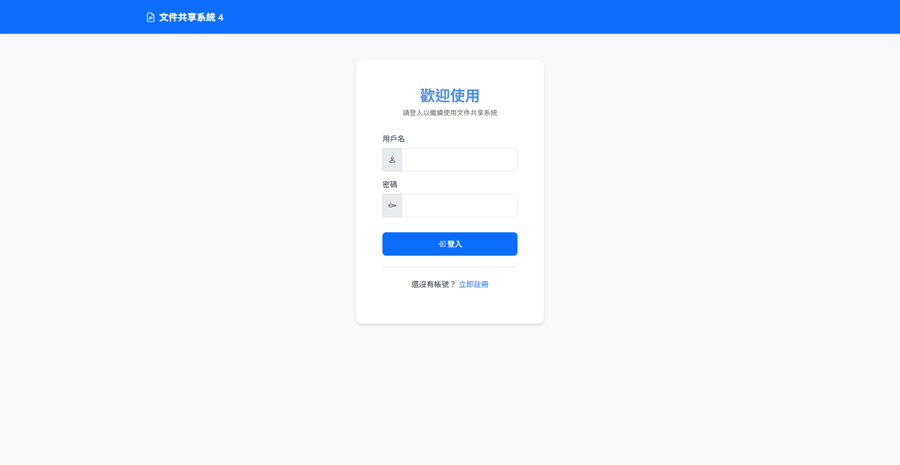
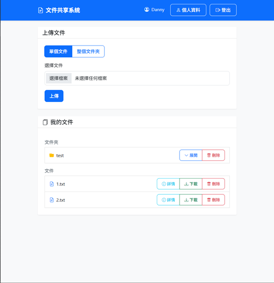
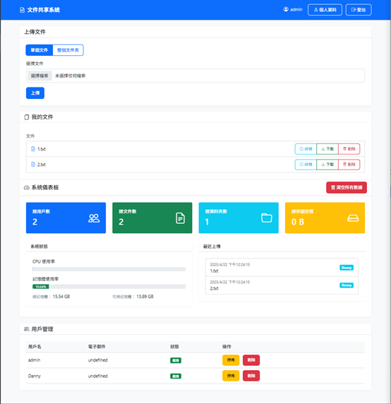
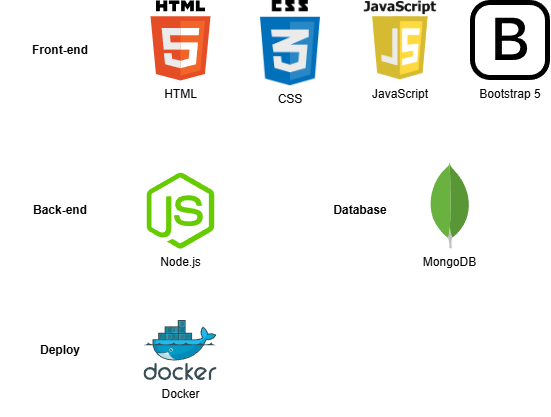

# 文件共享系統

This project was developed with the assistance of Cursor. 

一個基於 Node.js 和 MongoDB 的文件共享系統，支持文件上傳、下載、分享和管理功能。

## 功能特點

- 用戶管理
  - 用戶註冊和登入
  - 個人資料管理
  - 密碼修改
  - 用戶權限控制

- 文件管理
  - 文件上傳和下載
  - 文件夾創建和管理
  - 文件移動和組織
  - 文件共享設置

#### 功能展示

用戶登錄及注冊



用戶界面



### 管理員功能
- 用戶管理（啟用/停用、刪除）
- 系統狀態監控
- 存儲空間管理
- 批量數據清理

#### 功能展示

管理員界面及dashboard



## 技術路綫



- 後端：Node.js + Express
- 數據庫：MongoDB + Mongoose
- 文件存儲：GridFS
- 前端：HTML5 + CSS3 + JavaScript
- UI 框架：Bootstrap 5
- 認證：JWT
- 容器化：Docker + Docker Compose

## 部署方式

### 方式一：直接部署

1. 安裝依賴：
```bash
npm install
```

2. 配置環境變量：
創建 `.env` 文件並設置以下變量：
```
PORT=3500
MONGODB_URI=mongodb://localhost:27017/file-sharing
JWT_SECRET=your_jwt_secret
```

3. 運行服務器：
```bash
npm start
```

### 方式二：Docker 部署（推薦）

1. 確保已安裝 Docker 和 Docker Compose

2. 克隆專案：
```bash
git clone <repository-url>
cd file-sharing-system
```

3. 配置環境變量：
創建 `.env` 文件並設置以下變量：
```
PORT=3500
MONGODB_URI=mongodb://mongodb:27017/file-sharing
JWT_SECRET=your_jwt_secret
```

4. 構建並啟動容器：
```bash
docker-compose up -d
```

5. 查看容器狀態：
```bash
docker-compose ps
```

6. 查看日誌：
```bash
docker-compose logs -f
```

7. 停止服務：
```bash
docker-compose down
```

### Docker 配置說明

#### docker-compose.yml
```yaml
version: '3.8'

services:
  app:
    build: .
    ports:
      - "3500:3500"
    environment:
      - PORT=3500
      - MONGODB_URI=mongodb://mongodb:27017/file-sharing
      - JWT_SECRET=your_jwt_secret
    volumes:
      - ./uploads:/app/uploads
    depends_on:
      - mongodb

  mongodb:
    image: mongo:latest
    ports:
      - "27017:27017"
    volumes:
      - mongodb_data:/data/db

volumes:
  mongodb_data:
```

#### Dockerfile
```dockerfile
FROM node:16-alpine

WORKDIR /app

COPY package*.json ./

RUN npm install

COPY . .

EXPOSE 3500

CMD ["npm", "start"]
```

## API 文檔

### 用戶相關 API

#### 註冊
```
POST /api/auth/register
Content-Type: application/json

{
    "username": "用戶名",
    "email": "郵箱",
    "password": "密碼"
}
```

#### 登入
```
POST /api/auth/login
Content-Type: application/json

{
    "username": "用戶名",
    "password": "密碼"
}
```

#### 獲取個人資料
```
GET /api/users/profile
Authorization: Bearer <token>
```

#### 更新個人資料
```
PUT /api/users/profile
Authorization: Bearer <token>
Content-Type: application/json

{
    "username": "新用戶名",
    "email": "新郵箱"
}
```

#### 修改密碼
```
PUT /api/users/password
Authorization: Bearer <token>
Content-Type: application/json

{
    "currentPassword": "當前密碼",
    "newPassword": "新密碼"
}
```

### 文件相關 API

#### 上傳文件
```
POST /api/files/upload
Authorization: Bearer <token>
Content-Type: multipart/form-data

file: <文件>
parentFolder: <文件夾ID>
```

#### 獲取文件列表
```
GET /api/files/list
Authorization: Bearer <token>
```

#### 下載文件
```
GET /api/files/:fileId/download
Authorization: Bearer <token>
```

#### 刪除文件
```
DELETE /api/files/:fileId
Authorization: Bearer <token>
```

### 文件夾相關 API

#### 創建文件夾
```
POST /api/folders/create
Authorization: Bearer <token>
Content-Type: application/json

{
    "name": "文件夾名稱",
    "parentFolder": "父文件夾ID"
}
```

#### 獲取文件夾列表
```
GET /api/folders/list
Authorization: Bearer <token>
```

#### 獲取文件夾詳情
```
GET /api/folders/:folderId
Authorization: Bearer <token>
```

#### 刪除文件夾
```
DELETE /api/folders/:folderId
Authorization: Bearer <token>
```

### 管理員 API

#### 獲取系統統計
```
GET /api/admin/stats
Authorization: Bearer <token>
```

#### 獲取用戶列表
```
GET /api/admin/users
Authorization: Bearer <token>
```

#### 更新用戶狀態
```
PUT /api/admin/users/:userId/status
Authorization: Bearer <token>
Content-Type: application/json

{
    "status": "active/inactive"
}
```

#### 刪除用戶
```
DELETE /api/admin/users/:userId
Authorization: Bearer <token>
```

#### 清除所有數據
```
DELETE /api/admin/clear-all
Authorization: Bearer <token>
```

## 安裝和運行

1. 安裝依賴：
```bash
npm install
```

2. 配置環境變量：
創建 `.env` 文件並設置以下變量：
```
PORT=3500
MONGODB_URI=mongodb://localhost:27017/file-sharing
JWT_SECRET=your_jwt_secret
```

3. 運行服務器：
```bash
npm start
```

## 項目結構

```
.
├── src/
│   ├── models/         # 數據模型
│   ├── routes/         # API 路由
│   ├── middleware/     # 中間件
│   └── app.js         # 應用入口
├── public/            # 靜態文件
├── uploads/           # 文件上傳目錄
├── docker-compose.yml # Docker 配置
└── README.md         # 項目文檔
```

## API 文檔

詳細的 API 文檔請參考 [API.md](./API.md)

## 注意事項

1. 所有 API 請求（除了註冊和登入）都需要在請求頭中包含 JWT token
2. 文件上傳大小限制為 100MB
3. 管理員 API 需要管理員權限
4. 建議在生產環境中使用 HTTPS
5. 定期備份數據庫
6. 使用 Docker 部署時，確保 volumes 正確配置以持久化數據
7. 生產環境部署時建議使用 Docker Swarm 或 Kubernetes 進行容器編排
